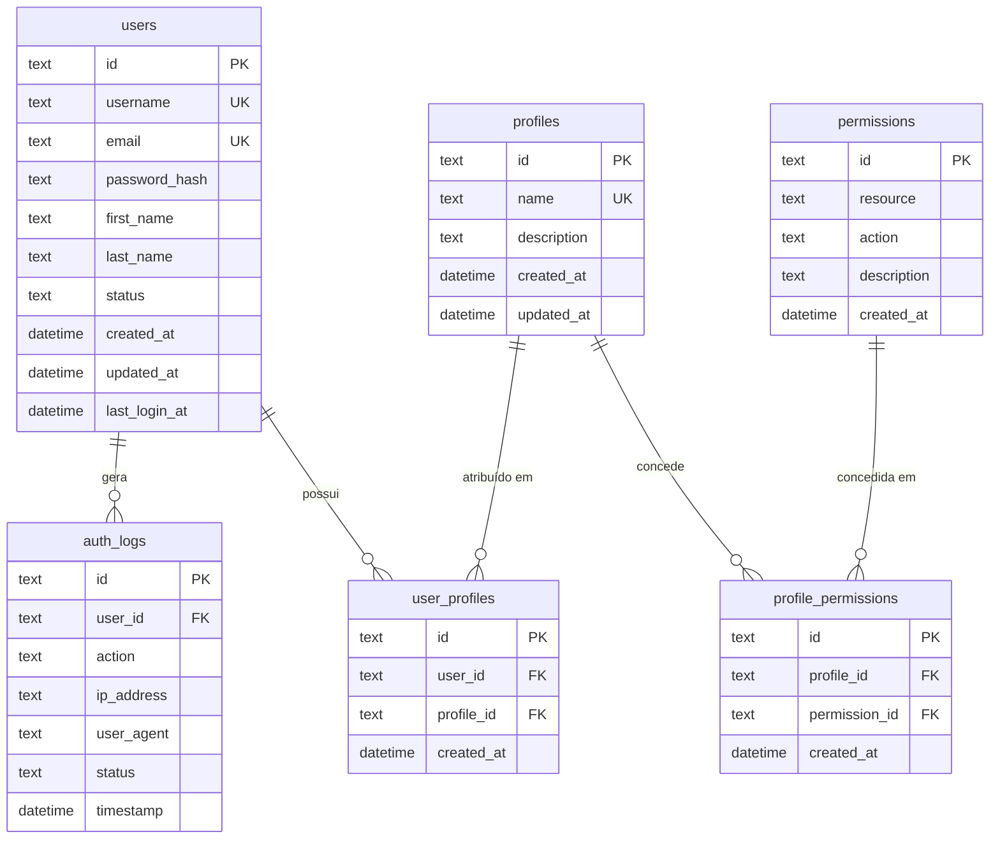
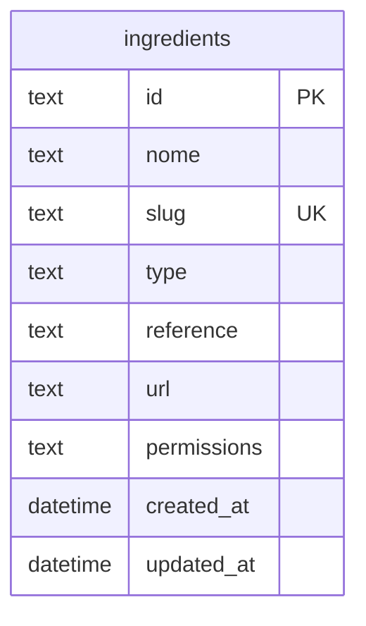
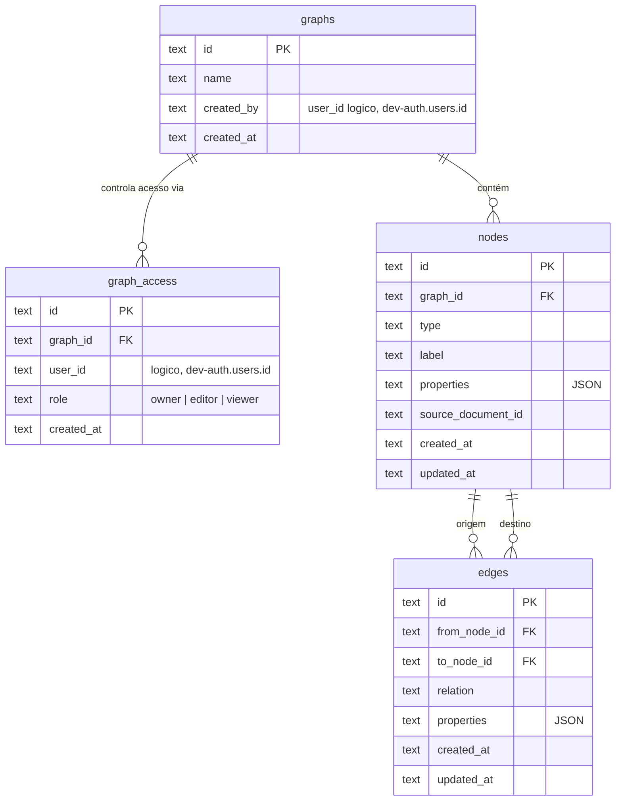
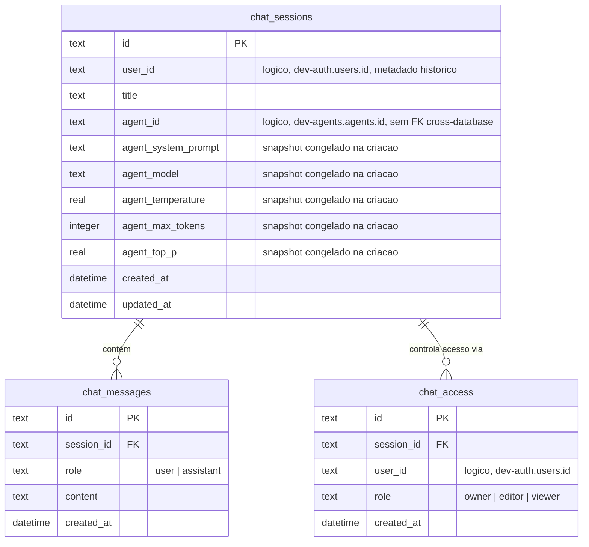
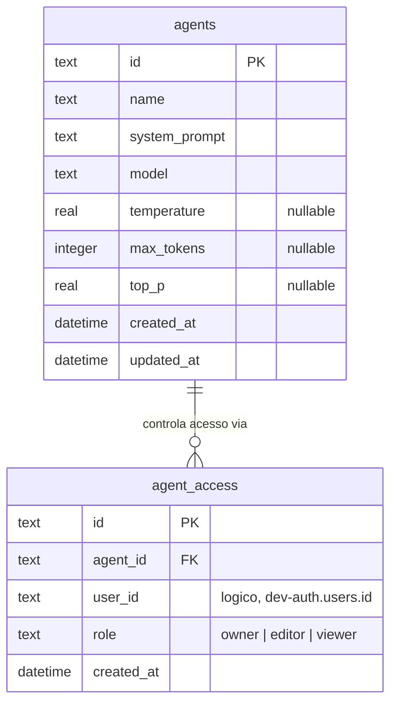
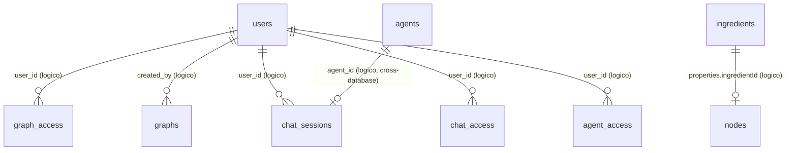

# Diagrama de Entidades dos Bancos de Dados

Este documento mapeia as tabelas dos cinco D1 do projeto (`dev-auth`, `dev-ingredient`, `dev-graph`, `dev-chat`, `dev-agents`, ver [ADR 0004](decisions/0004-d1-multiple-databases.md)) e como elas se relacionam. Cada D1 é isolado — não há `FOREIGN KEY` entre bancos diferentes; onde uma tabela referencia um `user_id`/`created_by` de outro D1 (ex.: `graph_access.user_id` → `dev-auth.users.id`), a relação é apenas lógica, aplicada no código do worker, não pelo SQLite.

## dev-auth

Usuários, autenticação, RBAC (profiles/permissions). Migrations: 0001, 0002, 0003 (seed), 0004, 0005 (seed), 0009 (seed), 0011 (seed), 0012 (seed), 0013 (seed).

Notas:
- `permissions` tem `UNIQUE(resource, action)` — cada permissão é um par `resource:action` (ex.: `graph:write`, `ai:chat`).
- `user_profiles` e `profile_permissions` são tabelas de junção N:N (`users` ↔ `profiles`, `profiles` ↔ `permissions`), ambas com `UNIQUE` composto para impedir duplicidade e `ON DELETE CASCADE` nas FKs.
- `auth_logs.user_id` não tem `ON DELETE CASCADE` (histórico de auditoria é preservado mesmo que o usuário seja removido).
- Perfis seedados: `profile-admin`, `profile-user`, `profile-guest`, `profile-rag-user`, `profile-api-user`, `profile-graph-user` (0008), `profile-ingredient-user`/`profile-ingredient-admin` (0009).

## dev-ingredient

Migration: 0006.

Sem relações com outras tabelas dentro do próprio D1. `api-worker` referencia `ingredients.id` como `properties.ingredientId` nos nodes do grafo de domínio `ingredients` (ver abaixo) — relação lógica, cross-database.

## dev-graph

Grafo de conhecimento, isolado por `graphs` (multi-tenant a partir da 0010). Migrations: 0007, 0010.

Notas:
- `graph_access` é a ACL por grafo (`UNIQUE(graph_id, user_id)`); todo grafo deve manter ao menos um `owner` (invariante aplicada em `graph-db.mjs`, não pelo schema — ver [spec de colaboradores](specs/graph-collaborator-management.md)).
- `nodes.graph_id` é `NULL`-ável no schema (SQLite não permite `ADD COLUMN ... NOT NULL` sem default constante — ver migration 0010), mas é sempre exigido pela camada de aplicação.
- `edges` tem `UNIQUE(from_node_id, to_node_id, relation)` (evita edges duplicadas) e `ON DELETE CASCADE` em ambas as FKs de `nodes`; `nodes.graph_id` também é `ON DELETE CASCADE` a partir de `graphs`.
- `properties` em `nodes`/`edges` é validado via `CHECK(json_valid(properties))`.
- Multi-tenancy por domínio (ADR 0016): grafos como `ingredients` (dono lógico `svc-api-ingredients`) e `rag-documents` (dono lógico `svc-rag-enrichment`) são apenas linhas em `graphs`, sem tabela própria — a segregação é 100% via `graph_id`.

## dev-chat

Sessões de chat do `ai-worker`, isoladas do fluxo stateless de `/v1/chat/completions` ([ADR 0019](decisions/0019-ai-worker-chat-sessions.md)), com ACL por sessão a partir da [ADR 0020](decisions/0020-chat-session-sharing-and-pagination.md) e colunas de snapshot de agent a partir da [ADR 0022](decisions/0022-agent-registration.md). Migrations: 0014, 0015, 0018.

Notas:
- `chat_messages.session_id` e `chat_access.session_id` são `ON DELETE CASCADE` a partir de `chat_sessions` (D1 aplica `PRAGMA foreign_keys`, diferente do SQLite padrão).
- `chat_sessions.user_id` não tem FK física para `dev-auth.users` (D1s são isolados) e, desde a migration 0015, deixou de ser a fonte de autorização — é só metadado histórico de quem criou a sessão. Toda checagem de acesso passa por `chat_access`.
- `chat_access` é a ACL por sessão (`UNIQUE(session_id, user_id)`), mesmo modelo de `graph_access` ([ADR 0012](decisions/0012-graph-worker-knowledge-graph.md)): papéis `owner`/`editor`/`viewer`, com a invariante de que toda sessão deve manter ao menos um `owner` (aplicada em `chat-db.mjs`, não pelo schema — ver [ADR 0020](decisions/0020-chat-session-sharing-and-pagination.md)). A migration 0015 faz backfill de uma linha `owner` para cada sessão já existente antes dela.
- `agent_id` e as cinco colunas `agent_*` (migration 0018) são todas nullable e sem `FOREIGN KEY` — `dev-agents` é um D1 separado e D1/SQLite não suporta FK cross-database. Preenchidas apenas quando a sessão é criada com um `agent_id` no corpo; ficam `null` caso contrário. Uma vez copiado, o snapshot nunca é atualizado a partir de `dev-agents` novamente ([ADR 0022](decisions/0022-agent-registration.md)).
- Índices em `chat_sessions.user_id`, `chat_messages.session_id` e `chat_access.user_id`.

## dev-agents

Agents (configuração de IA reutilizável) do `ai-worker`, exclusivo desse worker ([ADR 0022](decisions/0022-agent-registration.md)). Migration: 0016.

Notas:
- `agent_access.agent_id` é `ON DELETE CASCADE` a partir de `agents`.
- `agent_access` é a ACL por agent (`UNIQUE(agent_id, user_id)`), mesmo modelo de `chat_access`/`graph_access`: papéis `owner`/`editor`/`viewer`, com a invariante de que todo agent deve manter ao menos um `owner` (aplicada em `agent-db.mjs`, não pelo schema).
- Índice em `agent_access.user_id` (listar "meus agents" via join, usado por `listAgentsForUser`).
- Sem relação física com `dev-chat.chat_sessions.agent_id` — ver nota da seção `dev-chat` acima.

## Relações lógicas entre bancos (sem FK física)

`rag-worker` (Vectorize, fora do D1) e `graphrag-worker` (orquestrador sem estado próprio) não possuem tabelas — não aparecem nos diagramas acima. `dev-chat` e `dev-agents` são exclusivos do `ai-worker` — nenhum outro worker acessa essas tabelas, diretamente ou via RPC.
