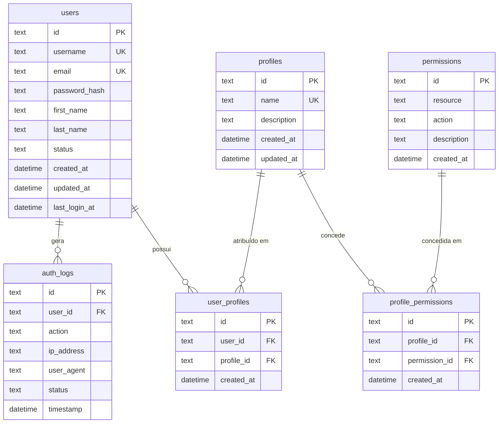
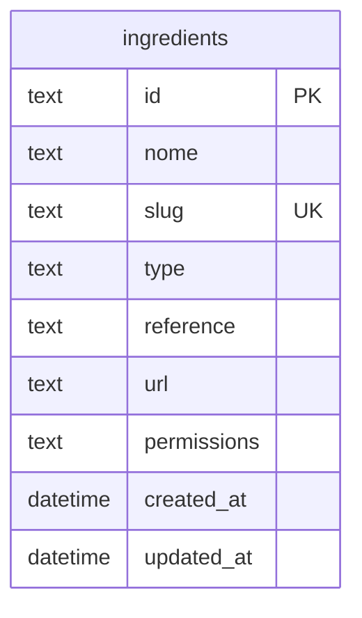
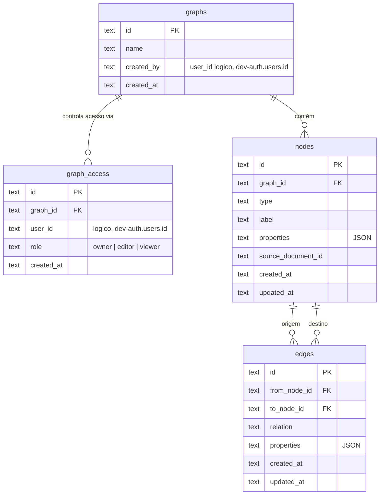
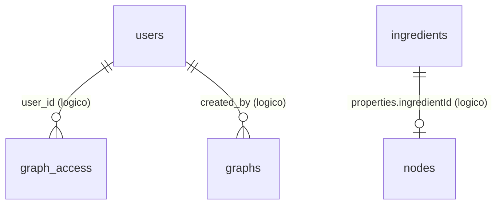

# Diagrama de Entidades dos Bancos de Dados

Este documento mapeia as tabelas dos três D1 do projeto (`dev-auth`, `dev-ingredient`, `dev-graph`, ver [ADR 0004](decisions/0004-d1-multiple-databases.md)) e como elas se relacionam. Cada D1 é isolado — não há `FOREIGN KEY` entre bancos diferentes; onde uma tabela referencia um `user_id`/`created_by` de outro D1 (ex.: `graph_access.user_id` → `dev-auth.users.id`), a relação é apenas lógica, aplicada no código do worker, não pelo SQLite.

## dev-auth

Usuários, autenticação, RBAC (profiles/permissions). Migrations: 0001, 0002, 0003 (seed), 0004, 0005 (seed), 0009 (seed), 0011 (seed), 0012 (seed), 0013 (seed).

Notas:
- `permissions` tem `UNIQUE(resource, action)` — cada permissão é um par `resource:action` (ex.: `graph:write`, `ai:chat`).
- `user_profiles` e `profile_permissions` são tabelas de junção N:N (`users` ↔ `profiles`, `profiles` ↔ `permissions`), ambas com `UNIQUE` composto para impedir duplicidade e `ON DELETE CASCADE` nas FKs.
- `auth_logs.user_id` não tem `ON DELETE CASCADE` (histórico de auditoria é preservado mesmo que o usuário seja removido).
- Perfis seedados: `profile-admin`, `profile-user`, `profile-guest`, `profile-rag-user`, `profile-api-user`, `profile-graph-user` (0008), `profile-ingredient-user`/`profile-ingredient-admin` (0009).

## dev-ingredient

Migration: 0006.

Sem relações com outras tabelas dentro do próprio D1. `api-worker` referencia `ingredients.id` como `properties.ingredientId` nos nodes do grafo de domínio `ingredients` (ver abaixo) — relação lógica, cross-database.

## dev-graph

Grafo de conhecimento, isolado por `graphs` (multi-tenant a partir da 0010). Migrations: 0007, 0010.

Notas:
- `graph_access` é a ACL por grafo (`UNIQUE(graph_id, user_id)`); todo grafo deve manter ao menos um `owner` (invariante aplicada em `graph-db.mjs`, não pelo schema — ver [spec de colaboradores](specs/graph-collaborator-management.md)).
- `nodes.graph_id` é `NULL`-ável no schema (SQLite não permite `ADD COLUMN ... NOT NULL` sem default constante — ver migration 0010), mas é sempre exigido pela camada de aplicação.
- `edges` tem `UNIQUE(from_node_id, to_node_id, relation)` (evita edges duplicadas) e `ON DELETE CASCADE` em ambas as FKs de `nodes`; `nodes.graph_id` também é `ON DELETE CASCADE` a partir de `graphs`.
- `properties` em `nodes`/`edges` é validado via `CHECK(json_valid(properties))`.
- Multi-tenancy por domínio (ADR 0016): grafos como `ingredients` (dono lógico `svc-api-ingredients`) e `rag-documents` (dono lógico `svc-rag-enrichment`) são apenas linhas em `graphs`, sem tabela própria — a segregação é 100% via `graph_id`.

## Relações lógicas entre bancos (sem FK física)

`rag-worker` (Vectorize, fora do D1) e `graphrag-worker` (orquestrador sem estado próprio) não possuem tabelas — não aparecem nos diagramas acima.
