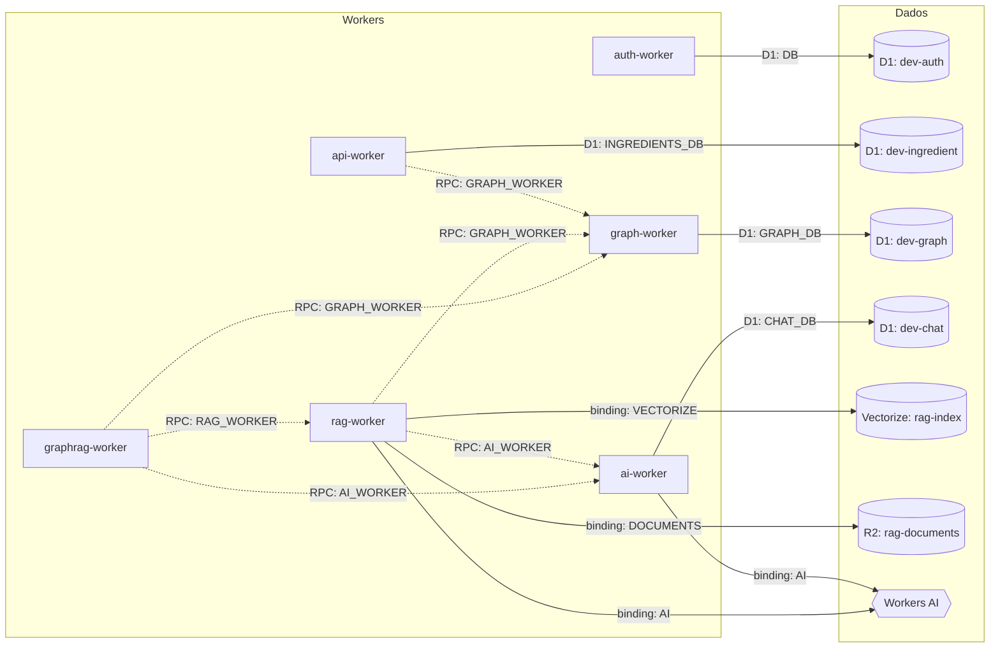

# Diagrama de Dependências: Workers e Bancos de Dados

Mapeia os 6 Cloudflare Workers do projeto, seus bindings de dados (D1, R2, Vectorize, Workers AI) e as chamadas Service Binding (RPC) entre eles — fonte: `terraform/environments/dev/terraform.tfvars`, `terraform/locals.tf`, `terraform/rag.tf` e `terraform/modules/rag/main.tf`.

Legenda: seta sólida = binding direto de dados (D1/R2/Vectorize/Workers AI); seta pontilhada = Service Binding (chamada RPC via `WorkerEntrypoint`, ver [ADR 0015](decisions/0015-service-bindings-rpc-worker-communication.md)).

## Bindings por worker

| Worker | Dados próprios | RPC (Service Binding) | `JWT_SECRET`? |
|---|---|---|---|
| `api` | D1 `dev-ingredient` (`INGREDIENTS_DB`) | → `graph` (`GRAPH_WORKER`) | sim |
| `auth` | D1 `dev-auth` (`DB`) | — | sim |
| `ai` | Workers AI (`AI`), D1 `dev-chat` (`CHAT_DB`) | expõe `chat()` para outros workers | sim |
| `graph` | D1 `dev-graph` (`GRAPH_DB`) | expõe `upsertNode`/`updateNode`/`deleteNode`/`createEdge`/`getNeighbors`/`findPaths`/`findNodeByLabel` | sim |
| `rag` | Workers AI (`AI`), Vectorize (`VECTORIZE`), R2 (`DOCUMENTS`) | → `graph` (`GRAPH_WORKER`), → `ai` (`AI_WORKER`) | **não** (ver nota) |
| `graphrag` | nenhum (orquestrador puro, sem D1/R2/Vectorize próprio) | → `rag` (`RAG_WORKER`), → `graph` (`GRAPH_WORKER`), → `ai` (`AI_WORKER`) | sim |

`JWT_SECRET` é injetado automaticamente em todo worker declarado em `var.workers` (`terraform/locals.tf`, `local.jwt_secret_binding` concatenado a cada binding set). `rag-worker` é declarado em `var.rag_stacks`, um caminho Terraform separado (`terraform/rag.tf`) que **não** concatena esse binding — por isso é o único worker sem `JWT_SECRET` garantido, e o motivo de seu `requireAuth` pular a checagem quando a env var está ausente (única exceção a "falha fechado" entre os 6 workers, documentada no [spec ai-chat-and-auth-stats](specs/ai-chat-and-auth-stats-permissions.md)).

## Notas

- **Nenhum worker acessa o D1 `dev-graph` diretamente exceto o próprio `graph-worker`** — `api-worker`, `rag-worker` e `graphrag-worker` só leem/escrevem nodes/edges via RPC (`GRAPH_WORKER.upsertNode`, etc.), nunca com um binding D1 direto. Isso mantém a validação de ACL (`graph_access`, ver [diagrama de entidades](database-diagram.md)) centralizada num único worker.
- **D1 `dev-chat` é exclusivo do `ai-worker`** (binding `CHAT_DB`) — nenhum outro worker o acessa, diretamente ou via RPC; sessões de chat não são expostas a outros workers ([ADR 0019](decisions/0019-ai-worker-chat-sessions.md)).
- Chamadas RPC ao `graph-worker` passam um `actorSub` explícito (ex.: `svc-api-ingredients`, `svc-rag-enrichment`, ver [ADR 0016](decisions/0016-domain-graph-service-accounts-and-fire-and-forget-enrichment.md)) e checam só o papel desse actor em `graph_access` — não repetem a permission RBAC `graph:read`/`graph:write`, que fica exclusiva do caminho HTTP.
- `graphrag-worker` é puramente um orquestrador: não tem D1, R2 ou Vectorize próprios, só agrega as respostas de `rag`, `graph` e `ai` via RPC.
- Service Bindings são só alcançáveis dentro da mesma conta Cloudflare — não passam pela borda HTTP pública, então não sofrem o enforcement de permission RBAC do JWT (que é exclusivo das rotas HTTP de cada worker).
